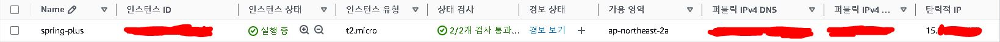
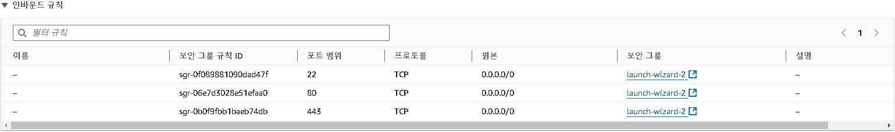

# 레거시 코드 리팩토링 플러스

이 문서는 코드 개선 및 새로운 기능 구현을 위한 문제들을 다룹니다.  
각 문제를 해결하기 위한 세부 사항은 아래에서 확인할 수 있습니다.

---

## 사용된 기술

이 프로젝트는 다음과 같은 기술 스택을 사용하여 구현되었습니다.
- **Java 17**: 주 프로그래밍 언어로 사용.
- **Spring Boot**
- **JPA (Hibernate)**
- **QueryDSL**
- **JWT (JSON Web Token)**: 사용자 인증 및 권한 관리를 위한 토큰 기반 인증 방식.
- **Spring Security**: 권한 및 인증 관리를 위한 프레임워크.
- **MySQL (RDS)**
- **AWS EC2**

## Level 1

### 1. 코드 개선 퀴즈 - @Transactional의 이해

**문제 설명:**  
할 일 저장 기능을 구현한 API(`/todos`) 호출 시 다음과 같은 에러가 발생합니다.

**목표:**  
에러를 수정하여 할 일을 정상적으로 저장할 수 있도록 `@Transactional`의 올바른 사용을 적용하세요.

---

### 2. 코드 추가 퀴즈 - JWT의 이해

**문제 설명:**  
User의 정보에 `nickname`이 필요하게 되었습니다.  
또한, 프론트엔드에서 JWT에 포함된 유저의 `nickname`을 화면에 표시하고자 합니다.

**목표:**
- User 테이블에 `nickname` 컬럼을 추가하고 중복을 허용하도록 설정하세요.
- JWT에 `nickname`을 포함하여 프론트엔드에서 사용할 수 있도록 수정하세요.

---

### 3. 코드 개선 퀴즈 - AOP의 이해

**문제 설명:**  
`UserAdminController` 클래스의 `changeUserRole()` 메소드 실행 전 로그를 남겨야 합니다.  
현재 AOP가 의도대로 동작하지 않고 있습니다.

**목표:**  
`AdminAccessLoggingAspect` 클래스의 AOP를 수정하여 `changeUserRole()` 실행 전 로그가 기록되도록 하세요.

---

### 4. 테스트 코드 퀴즈 - 컨트롤러 테스트의 이해

**문제 설명:**  
테스트 패키지 `org.example.expert.domain.todo.controller`에서 `todo_단건_조회_시_todo가_존재하지_않아_예외가_발생한다()` 테스트가 실패하고 있습니다.

**목표:**  
테스트가 통과하도록 테스트 코드를 수정하세요.

---

### 5. 코드 개선 퀴즈 - JPA의 이해

**문제 설명:**  
할 일 검색 시 `weather` 조건으로도 검색할 수 있어야 하며, 수정일 기준 기간 검색 기능도 필요합니다.  
`weather` 조건과 기간은 선택 사항입니다.

**목표:**
- `weather`와 기간 조건을 고려한 할 일 검색 기능을 JPQL로 구현하세요.
- 쿼리 메소드명을 너무 길지 않게 지정하세요.
- 필요 시 서비스에서 여러 쿼리를 if문으로 처리할 수 있습니다.

---

## Level 2

### 6. JPA Cascade

**문제 설명:**  
할 일을 새로 저장할 때, 할 일을 생성한 유저가 자동으로 담당자로 등록되어야 합니다.

**목표:**  
JPA의 `cascade` 기능을 활용하여 할 일 생성 시 유저가 담당자로 자동 등록되도록 코드를 수정하세요.

---

### 7. N+1 문제 해결

**문제 설명:**  
`CommentController`의 `getComments()` API를 호출할 때 N+1 문제가 발생하고 있습니다.

**목표:**  
N+1 문제가 발생하지 않도록 코드를 개선하세요.

---

### 8. QueryDSL 변환

**문제 설명:**  
`TodoService.getTodo` 메소드에서 JPQL로 작성된 `findByIdWithUser` 메소드를 QueryDSL로 변경해야 합니다.

**목표:**
- QueryDSL을 사용하여 코드를 변환하세요.
- N+1 문제가 발생하지 않도록 주의하세요.

---

### 9. Spring Security 도입

**문제 설명:**  
기존에 사용하던 `Filter`와 `Argument Resolver` 기반의 인증 및 권한 관리 코드를 Spring Security로 변경하려고 합니다.

**목표:**
- Spring Security를 도입하여 권한 관리를 구현하세요.
- JWT 기반 인증 방식을 유지하면서 Spring Security의 권한 기능을 사용하세요.

---

## Level 3

### 10. QueryDSL을 사용한 검색 기능 구현

**문제 설명:**  
일정을 검색하는 API를 만들고 성능 최적화를 위해 QueryDSL과 Projections를 사용하여 필요한 필드만 반환하는 검색 기능을 구현해야 합니다.

**검색 조건:**
- 일정 제목 키워드 검색 (부분 일치 가능)
- 일정 생성일 기준 검색 (최신순 정렬)
- 담당자의 닉네임으로 검색 (부분 일치 가능)

**반환 정보:**
- 제목만 반환
- 일정의 담당자 수
- 일정의 총 댓글 개수

**목표:**
- QueryDSL을 사용하여 검색 기능을 구현하세요.
- 페이징 처리가 되도록 API를 설계하세요.

---

## Health Check API

이 프로젝트는 서버의 Live 상태를 확인할 수 있는 Health Check API를 제공합니다.

### 사용법

서버가 정상적으로 실행 중인지 확인하려면 다음 API를 호출하세요.

- **Endpoint**: `/health`
- **Method**: GET
- **Response**: `"Server is running"` (HTTP 200)

### 12-1. EC2

